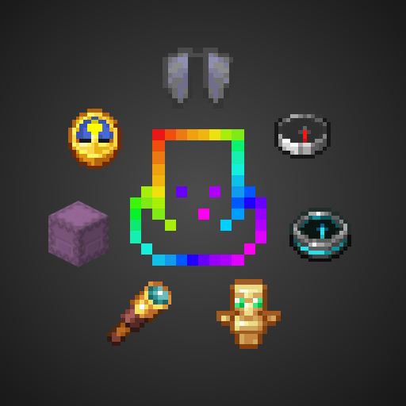

# Accessorify

## Download from [Modrinth](https://modrinth.com/mod/accessorify) / [CurseForge](https://www.curseforge.com/minecraft/mc-mods/accessorify)

This mod lets you equip some vanilla items as accessories using [Accessories](https://modrinth.com/mod/accessories), adding new functionality and saving up inventory space.

When any of them are equipped, a copy of the accessory slot they took is created, so that they don't take up any accessory slots (e.g. equipping the Elytra takes up the Cape slot, but an empty Cape slot is created so you can slot in another accessory).

You can choose which items will be turned into accessories in the configuration menu, among some other configuration options, if you want to pick and choose. By default, all of the items listed below are turned into accessories.

Both Fabric and NeoForge versions require [Accessories](https://modrinth.com/mod/accessories) and all of its dependencies. The configuration menu can be accessed using [ModMenu](https://modrinth.com/mod/modmenu) on Fabric, and the built-in Mods menu on NeoForge.

### Elytra

The Elytra can now be equipped in the Cape slot. There is no additional functionality, but it frees up the chest slot so you can equip both a chestplate and the Elytra at the same time.

### Totem of Undying

Totem of Undying can now be equipped in the Charm slot. When equipped, the totem will be triggered and consumed to save you from death, as if you were holding it in your hands.

### Spyglass

The spyglass can now be equipped in the Belt slot. When equipped, pressing and holding C (default keybind, configurable) uses the spyglass to zoom in. Using the scroll wheel while zooming in with the spyglass changes the zoom level.

### Shulker boxes

These can now be equipped in the Back slot. When equipped, pressing B (default keybind, configurable) will open the shulker box. Multiple shulker boxes can be equipped, and pressing the keybind in that case will open a small menu where you can choose which shulker box to open. By default you have 3 shulker slots. If you want more (or less), follow the instructions below:

Open the Accessories config in-game, scroll down until you see "Slot Amount Modifiers" and do the following:

### Clock, compass, recovery compass

These can now be equipped in the Wrist slot. When equipped, relevant info will be shown in the top left corner of the screen:

- Compass: coordinates, heading, biome
- Clock: time and day, weather, season (if [Serene Seasons](https://modrinth.com/mod/serene-seasons) is installed)
- Recovery compass: last death coordinates

Overlay appearance can be configured in the configuration screen. There is also an option to hide information shown by the compass and clock from the F3 debug screen, so that they are the only sources of such information.

## Mod Compatibility

- [Deeper and Darker](https://modrinth.com/mod/deeperdarker): Soul Elytra equippable in Cape slot
- [Friends and Foes](https://modrinth.com/mod/friends-and-foes): Totem of Freezing and Totem of Illusion equippable in Charm slot
- [Serene Seasons](https://modrinth.com/mod/serene-seasons) or [Fabric Seasons](https://modrinth.com/mod/fabric-seasons) + [Fabric Seasons Extras](https://modrinth.com/mod/fabric-seasons-extras): Calendar equippable in the Charm slot and shows the current season in the info overlay
- [Notes](https://modrinth.com/mod/notes): If "Hide gameplay info from F3 menu in survival" is on, the buttons used to add info such as coordinates to notes will be disabled unless you have a compass equipped